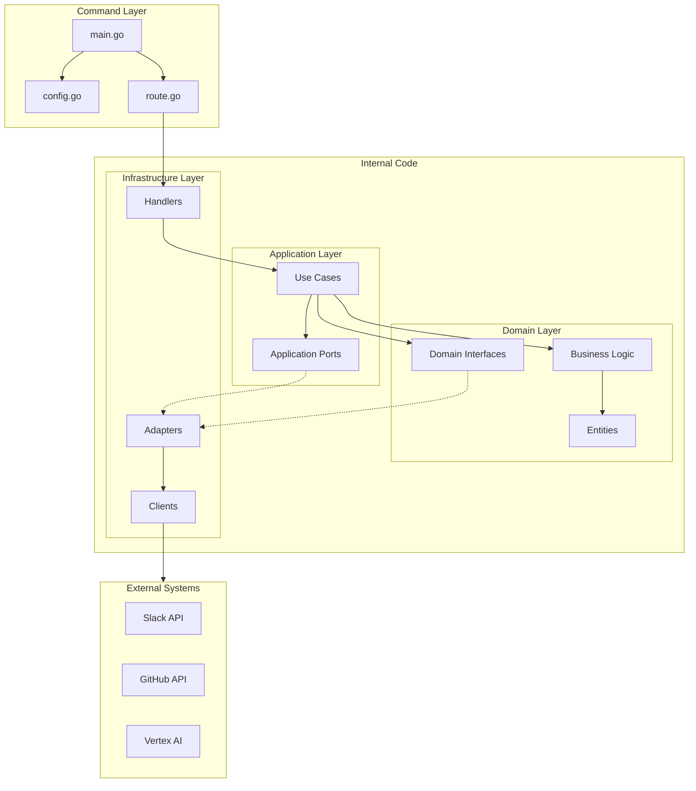
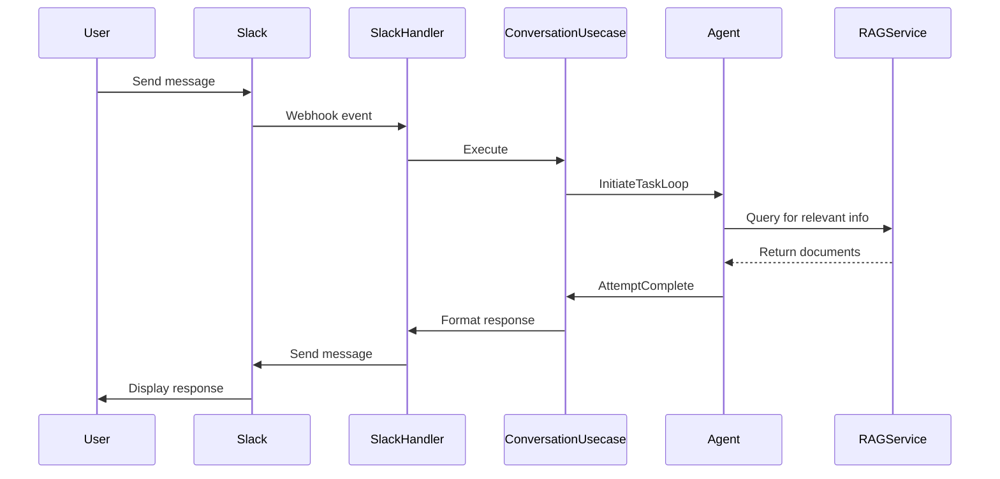
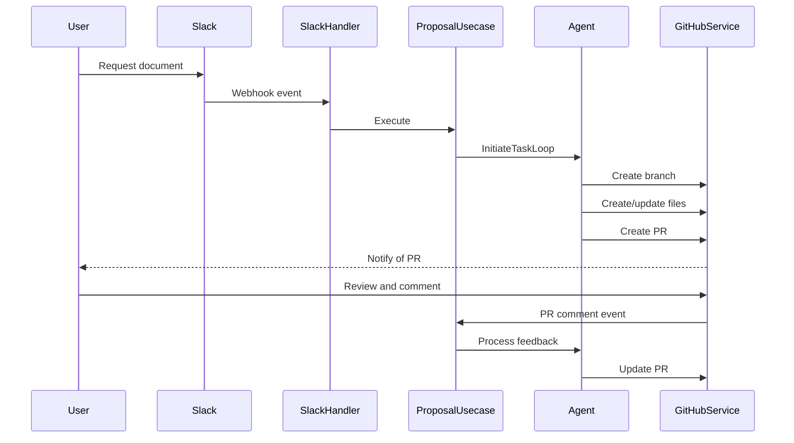

# System Patterns

## Architecture Overview

Docgent follows a hybrid architecture that primarily draws from hexagonal (ports and adapters) architecture, with elements of Clean Architecture and Onion Architecture. This approach separates the application into distinct layers with clear responsibilities and dependencies, enabling better testability, maintainability, and flexibility.



## Directory Structure

### /cmd
- **Purpose**: Contains the entry points for the application
- **Dependencies**: Depends on internal packages but contains minimal logic
- **Key Components**:
  - **/server**: 
    - `main.go`: Application entry point and dependency injection setup using Uber's fx
    - `config.go`: Configuration loading and validation
    - `route.go`: HTTP routing setup
    - `github.go`, `slack.go`, etc.: External service configuration

### /internal
Contains the core application code, divided into three main layers:

#### /domain
- **Purpose**: Contains the core business logic, entities, and some domain-specific interfaces
- **Dependencies**: Only depends on standard Go packages, no external dependencies
- **Key Components**:
  - **Entities**: Core domain objects (`message.go`, `agent.go`, etc.)
  - **Business Logic**: Core algorithms and rules
  - **Domain Interfaces**: Some interfaces defined at the domain level (e.g., `FileRepository`, `SourceRepository` in `domain/data`)
  - **Tool Use**: XML-based tool definitions and parsing logic
  - **System Instructions**: Templates and builders for LLM prompts

#### /application
- **Purpose**: Orchestrates domain logic to fulfill user goals
- **Dependencies**: Depends on domain layer and standard packages only
- **Key Components**:
  - **Use Cases**: Implements specific application features
    - `conversation.go`: Manages user interactions and conversation flow
    - `proposal_generate.go`: Handles document generation
    - `question_answer.go`: Processes user questions
  - **Ports**: Defines application-level interfaces for external services
    - `conversation.go`: Interface for conversation services
    - `file.go`: Interface for file operations
    - `rag.go`: Interface for RAG operations
  - **Tool Use Handlers**: Implements handlers for agent tools
    - `attempt_complete_handler.go`: Handles task completion
    - `query_rag_handler.go`: Handles RAG queries
    - `find_file_handler.go`: Handles file search operations

#### /infrastructure
- **Purpose**: Implements adapters for external services and technical concerns
- **Dependencies**: Can depend on domain, application, and external libraries
- **Key Components**:
  - **Adapters**: Implementations of both domain and application interfaces
    - **/github**: GitHub API client and related services
    - **/slack**: Slack API client and related services
    - **/google/vertexai**: Vertex AI and RAG integration
  - **Handlers**: HTTP handlers for external events
    - `github_events_handler.go`: Handles GitHub webhook events
    - `slack_events_handler.go`: Handles Slack events
    - `health_handler.go`: Health check endpoint

## Key Design Patterns

### Hybrid Architecture Approach
- Combines elements of Hexagonal, Clean, and Onion architectures
- Domain layer contains both core business logic and some domain-specific interfaces
- Application layer defines additional ports for external services
- All dependencies point inward, maintaining architectural integrity

### Platform Agnosticism
- Domain layer is kept free of specific platform concepts (Slack, GitHub)
- System designed to potentially integrate with other platforms beyond MVP
- Clear boundaries between domain concepts and their implementations
- Using platform-neutral terminology (e.g., "Proposals" instead of "pull requests")

### Dependency Injection
- Uses Uber's fx library for dependency injection
- Components declare their dependencies and fx resolves the dependency graph
- Enables easier testing and component replacement

```go
fx.Provide(
    NewApplicationConfigServiceFromEnv,
    newSlackAPI,
    newGitHubAPI,
    // ...
)
```

### Ports and Adapters
- Both domain and application layers define interfaces that infrastructure implements
- Domain interfaces focus on core domain operations (e.g., `FileRepository`, `SourceRepository`)
- Application interfaces focus on external service integration (e.g., `ConversationService`, `RAGService`)
- Examples:
  - `port.ConversationService` interface implemented by both Slack and GitHub adapters
  - `data.FileRepository` interface implemented by GitHub adapter

### Tool Use Pattern
- Agent communicates with the system through structured XML commands
- Each tool has a defined schema and handler
- Enables clear separation between agent decision-making and action execution

```go
type AttemptComplete struct {
    XMLName  xml.Name  `xml:"attempt_complete"`
    Messages []Message `xml:"message"`
    Sources  []Source  `xml:"source"`
}
```

### Repository Pattern
- Used for data access abstraction
- Defined in the domain layer, reflecting DDD principles
- Examples:
  - `FileRepository`: Abstracts file operations
  - `SourceRepository`: Abstracts source document operations

### Factory Pattern
- Used to create complex objects with proper configuration
- Examples:
  - `github.NewServiceProvider`: Creates GitHub service instances
  - `slack.NewServiceProvider`: Creates Slack service instances

### Strategy Pattern
- Used to select algorithms at runtime
- Example: Different conversation services for different platforms (Slack vs. GitHub)

## Communication Flow

### Slack Interaction Flow



### Document Generation Flow



## Error Handling Strategy

- Domain errors are defined in dedicated error.go files
- Errors are wrapped with context using `fmt.Errorf("context: %w", err)`
- Infrastructure layer translates technical errors to domain errors
- User-facing errors are generic and friendly

## Testing Strategy

- Unit tests for business logic
- Mock external dependencies for isolation
- Tests are organized in the same package as the code they test
- Test functions follow the pattern `Test{FunctionName}_{Scenario}`
